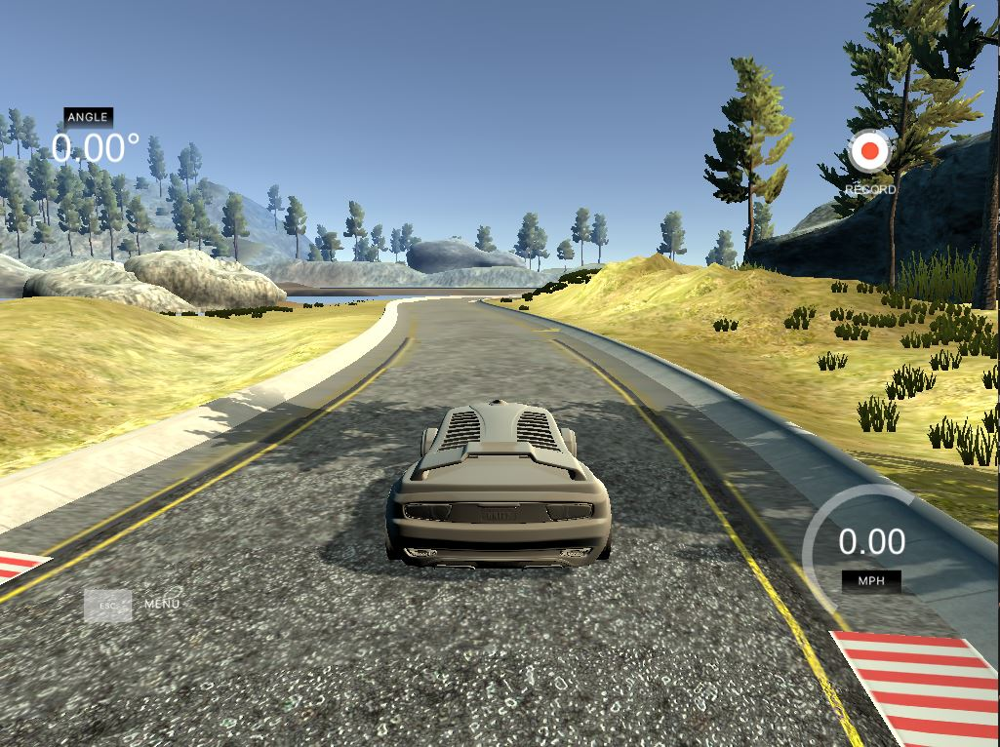

# Project: Behavioral Cloning

[](http://www.udacity.com/drive)

Click on the image to check out the Keras Behavioral Cloning demo video:

[](https://youtu.be/HwXI2E19SjY)

Overview
---

The purpose of this project was to use deep neural networks (DNN) and convolutional neural networks (CNN) knowledge and apply it to build a Keras CNN model that clones driving behavior from a car simulator. This project involved driving the car manually in Udacity's driving simulator to collect driving behavior data, which was saved to a folder that we got to choose. Then I built a Python ETL pipeline to extract the driving behavior data from the appropriate folder, transform the data by enriching it with data augmentation and other preprocessing techniques, then load the data into the CNN model to train it. This model is being trained on predicting the appropriate steering angle per image. After validating the model, the final part of the project was to test this trained model on the first track in the simulator to see if it can drive the car safely for 1 lap.

Contents
---

- **[writeup.md](writeup.md)**: explains my behavioral cloning application and each rubric point with a description of how that point was addressed
- **[drive.py](drive.py)**: for driving the car in autonomous mode
- **[model.h5](model.h5)**: containing a trained Keras convolution neural network 
- **[model.py](model.py)**: containing the script to create and train the model
- **[video.mp4](video.mp4)**: a video recording of the vehicle driving autonomously around the track for at least one full lap
- **[video.py](video.py)**: containing the script to create a video based on images found in a `run_[num]` directory
- **README.md**: provides overview of the project and how to set it up
- **data/**: contains image data that could be from collecting the simulator data, also contains images used in the writeup


## Dependencies
This lab requires:

* [CarND Term1 Starter Kit](https://github.com/udacity/CarND-Term1-Starter-Kit)

The lab enviroment can be created with CarND Term1 Starter Kit. Click [here](https://github.com/udacity/CarND-Term1-Starter-Kit/blob/master/README.md) for the details.

The simulator can be downloaded from the Github link: [self-driving-car-sim](https://github.com/udacity/self-driving-car-sim).

## How to Run the Demo

### Deploy the Trained Model in the Simulator

- `drive.py`: requires you have a saved trained model as an h5 file, i.e. `model.h5`

After you download the Udacity Self-Driving Car Simulator, start up the simulator, then select autonomous mode.

Execute the following command in your terminal:

~~~bash
python drive.py model.h5
~~~

> Note: if you want to save a video while you deploy the model in autonomous mode, refer to **Save a Video of the Autonomous Agent**.

The above command loads the trained model **model.h5** and uses the model to make predictions on individual images in real-time and send the predicted angle back to the server via a websocket connection. This action allows the model to control the ccar in the simulator and drive the car autonomously through controlling the car's steering. 

Note: There is known local system's setting issue with replacing "," with "." when using drive.py. When this happens it can make predicted steering values clipped to max/min values. If this occurs, a known fix for this is to add "export LANG=en_US.utf8" to the bashrc file.

### Save a Video of the Autonomous Agent

You can also select a directory to save images seen by the model while the car drives in autonomous mode by executing:

~~~bash
python drive.py model.h5 run1
~~~

- `run1` is the directory in which to save the images seen by the agent. If the directory already exists, it'll be overwritten.

Example of run1 directory content:

```sh
ls run1

[2017-01-09 16:10:23 EST]  12KiB 2017_01_09_21_10_23_424.jpg
[2017-01-09 16:10:23 EST]  12KiB 2017_01_09_21_10_23_451.jpg
[2017-01-09 16:10:23 EST]  12KiB 2017_01_09_21_10_23_477.jpg
[2017-01-09 16:10:23 EST]  12KiB 2017_01_09_21_10_23_528.jpg
[2017-01-09 16:10:23 EST]  12KiB 2017_01_09_21_10_23_573.jpg
[2017-01-09 16:10:23 EST]  12KiB 2017_01_09_21_10_23_618.jpg
[2017-01-09 16:10:23 EST]  12KiB 2017_01_09_21_10_23_697.jpg
[2017-01-09 16:10:23 EST]  12KiB 2017_01_09_21_10_23_723.jpg
[2017-01-09 16:10:23 EST]  12KiB 2017_01_09_21_10_23_749.jpg
[2017-01-09 16:10:23 EST]  12KiB 2017_01_09_21_10_23_817.jpg
...
```

The image file name is a timestamp of when the image was seen. This information is used by `video.py` to create a chronological video of the agent driving.

~~~bash
python video.py run1
~~~

Creates a video based on images found in the `run1` directory. The name of the video will be the name of the directory followed by `'.mp4'`, so, in this case the video will be `run1.mp4`.

Optionally, one can specify the FPS (frames per second) of the video:

```sh
python video.py run1 --fps 48
```

Will run the video at 48 FPS. The default FPS is 60.

#### Note: Why create a video

1. It's been noted the simulator might perform differently based on the hardware. So if your model drives succesfully on your machine it might not on another machine (your reviewer). Saving a video is a solid backup in case this happens.
2. You could slightly alter the code in `drive.py` and/or `video.py` to create a video of what your model sees after the image is processed (may be helpful for debugging).

### Optional: Collect Training Data in Simulator Training Mode

If you want to collect training data and train your own model. Turn on the simulator, then select training mode. Press **r** to record. It will ask you where you want to save the images and csv file. Choose a directory of your choice.

Now to train a new model once you collected the driving behavior data:

~~~bash
python model.py
~~~

### Tips
- Please keep in mind that training images are loaded in BGR colorspace using cv2 while drive.py load images in RGB to predict the steering angles.


