# Behavioral Cloning with Keras
---

The goals of this project were the following:
* Use the simulator to collect data of good driving behavior
* Build, a convolution neural network in Keras that predicts steering angles from images
* Train and validate the model with a training and validation set
* Test that the model successfully drives around track one without leaving the road
* Summarize the results with a written report

## Rubric Points 
---

### 1. Files Submitted & Code Quality

My project includes the following files:

* `model.py` containing the script to create and train the model
* `model.h5` containing a trained convolution neural network 
* `drive.py` for driving the car in autonomous mode
* `video.mp4` video recording of the CNN model driving the car safely for 1 lap
* `writeup.md` summarizing the results of the project

#### 2. Functional Code

Using the Udacity provided simulator and my `drive.py` file, the car can be driven autonomously around the track by executing

```sh
python drive.py model.h5
```

#### 3. Usable and Readable Code

The `model.py` file contains the code for training and saving the convolution neural network. The file shows the pipeline I used for training and validating the model, and it contains comments to explain how the code works.

~~~bash
python model.py
~~~

### Model Architecture and Training Strategy

#### 1. Model Architecture Employed for the Task

My model consists of a convolution neural network (model.py lines 76-117) with 5x5 and 3x3 filter sizes and depths between 24 and 64 using Keras Conv2D function The model includes RELU layers to introduce nonlinearity, the data is normalized in the model using a Keras lambda layer and the data is cropped using Keras Cropping2D function.  

~~~python
from keras.models import Sequential
from keras.layers import Flatten, Dense, Activation, Lambda, Cropping2D, Dropout, BatchNormalization
from keras.layers.convolutional import Conv2D
from keras.layers.pooling import MaxPooling2D

# Building Net Architecture based on Nvidia Self Driving Car Neural Network 
model = Sequential()
# Layer 1: Normalization
# Data preprocessing to normalize input images
model.add(Lambda(lambda x: (x/255.0) - 0.5, input_shape = (160, 320, 3)))
# Crop2D layer used to remove top 40 pixels, bottom 30 pixels of image
model.add(Cropping2D(cropping = ((50,20), (0,0))))
# Layer 2: Convolutional. 24 filters, 5 kernel, 5 stride, relu activation function
model.add(Conv2D(24,5,5, subsample = (2,2)))
model.add(BatchNormalization())
model.add(Activation('relu'))
# Layer 3: Convolutional. 36 filters
model.add(Conv2D(36,5,5, subsample = (2,2)))
model.add(BatchNormalization())
model.add(Activation('relu'))
# Layer 4: Convolutional. 48 filters
model.add(Conv2D(48,5,5, subsample = (2,2)))
model.add(BatchNormalization())
model.add(Activation('relu'))
# Layer 5: Convolutional. 64 filters
model.add(Conv2D(64,3,3))
model.add(BatchNormalization())
model.add(Activation('relu'))
# Layer 6: Convolutional. 64 filters
model.add(Conv2D(64,3,3))
model.add(BatchNormalization())
model.add(Activation('relu'))
### Flatten output into a vector
model.add(Flatten())
# Layer 7: Fully Connected
model.add(Dense(100))
model.add(BatchNormalization())
model.add(Activation('relu'))
# Layer 8: Fully Connected
model.add(Dense(50))
model.add(BatchNormalization())
model.add(Activation('relu'))
# Layer 9: Fully Connected
model.add(Dense(10))
model.add(BatchNormalization())
model.add(Activation('relu'))
# Layer 10: Fully Connected
model.add(Dense(1))
~~~

#### 2. Attempts to Reduce Overfitting in the Model

Prior to implementing the model, attempts to reduce overfitting were done using data augmentation techniques like mirroring images, adding left and right images to the dataset in order to help the model generalize better.
In the model, batch normalization layers were added to regularize the model in order to reduce overfitting (model.py lines 76-117). The model was trained and validated on different data sets to ensure that the model was not overfitting (code line 127). The model was tested by running it through the simulator and ensuring that the vehicle could stay on the track.

#### 3. Model Parameter Tuning

The model used an adam optimizer, so the learning rate was not tuned manually (model.py line 122).

#### 4. Appropriate Training Data Collected

Training data was chosen to keep the vehicle driving on the road. I used a combination, which included 2 laps of center lane driving in the counterclockwise and clockwise direction and 2 laps of recovery driving from the left and right sides of the road in the counterclockwise direction with an emphasis on curves and the bridge. I also did 1 recovery lap in the clockwise direction similar to one above. 

### Model Architecture and Documentation

#### 1. Solution Design Approach

The overall strategy for deriving a model architecture was to use the Nvidia CNN architecture published by their autonomous vehicle team because they had already used this architecture to train a real car to drive autonomously. In addition, this architecture was recommended in the lessons.

In order to gauge how well the model was working, I split my image and steering angle data into 80% for the training set and 20% for the validation set. To help the model generalize better, I collected more simulator data using the recommended data collected strategies, I applied data augmentation techniques to the data, which resulted in a low mean squared error for the training and validation set. 

The final step was to run the simulator to see how well the car was driving around track one. There were a few spots where the vehicle fell off the track. The car fell of the track when driving along the curved roads that have bodies of water in the field of view. Another unsafe situation was when the car drove at different times in both walls at the bridge. To improve the driving behavior in these cases, I collected 2 laps of recovery driving where I manually controlled the car to drive back to center of the road when it drove too close to the edge of the road with the body of water in the near distance. I collected 1 lap of recovery driving at the bridge when the car drove to close to the wall, I controlled the car to drive back to the center.

At the end of the process, the vehicle is able to drive autonomously around the track without leaving the road.

#### 2. Final Model Architecture

The final model architecture code is shown above. Here is a visualization of the architecture, curtiousy of the Nvidia research paper:


**Figure 1: Nvidia CNN Architecture**

The network has around 27 million connections and 250 thousand parameters according to Nvidia [End-to-End Deep Learning for Self-Driving Cars](https://devblogs.nvidia.com/deep-learning-self-driving-cars/) developer blog.

#### 3. Creation of the Training Set & Training Process

To capture good driving behavior, I collected data using the following strategies:

- 2 laps of center driving (counterclockwise)
- 2 laps of recovery driving from the sides focusing on the curves, bridge (counterclockwise)
- 2 laps of center driving (clockwise)
- 1 lap of recovery driving from the sides focusing on the curves, bridge (clockwise)

I first recorded two laps on track both using center lane driving in the counterclockwise direction. Here is an example image of center lane driving:

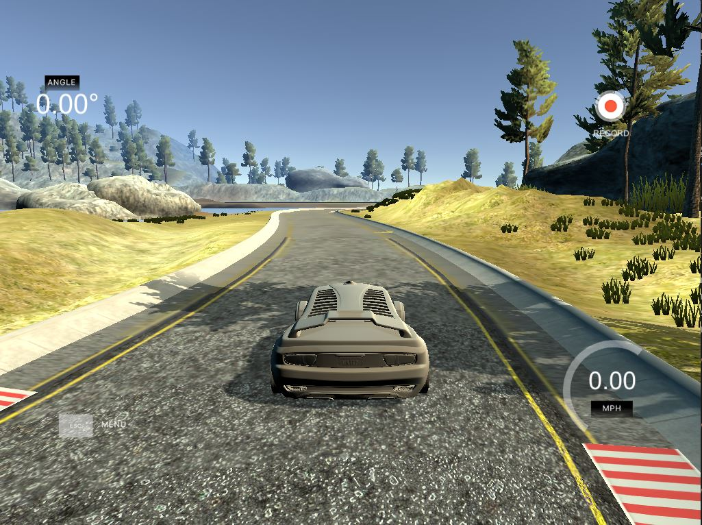

**Figure 2: Center Lane Driving**

I then recorded another lap with the vehicle recovering from the left side and right sides of the road back to center so that the vehicle would learn to recover when it drives to close to an edge of the road or bridge. These images show what a recovery looks like when driving to the right side of the road and back to the center along a curve:

**Driving recovery for right side of the road back to center:**

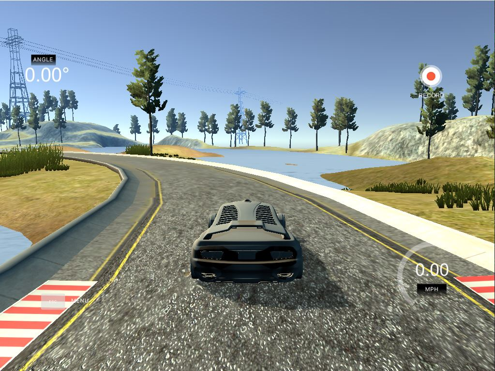

**Figure 3: Right Side of Road Recovery Part 1**

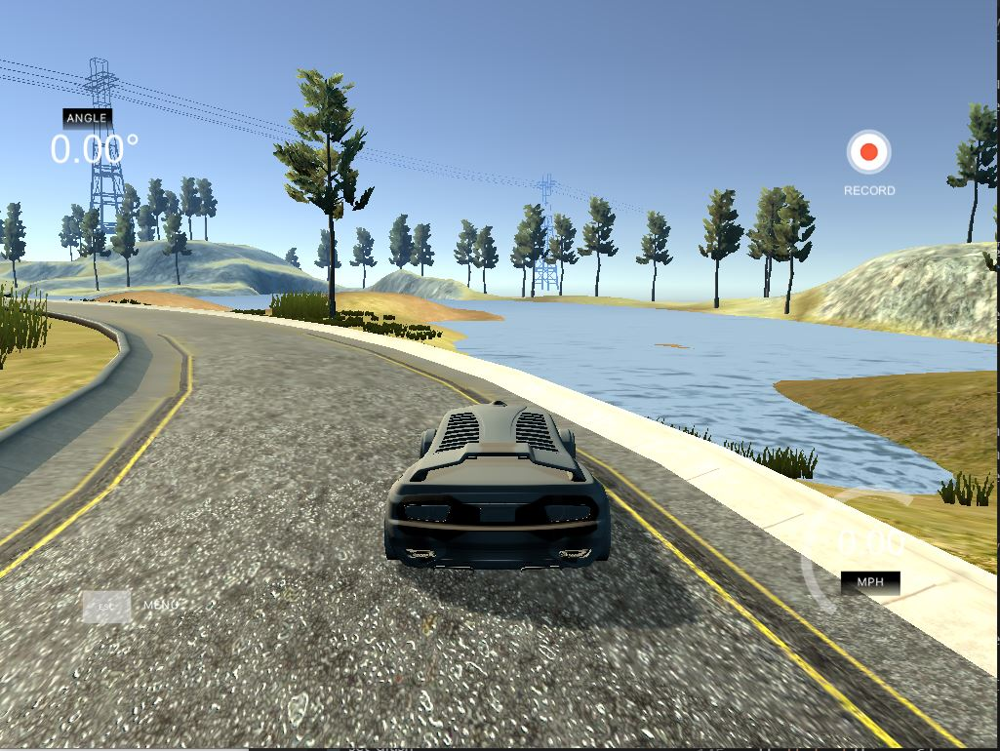

**Figure 4: Right Side of Road Recovery Part 2**

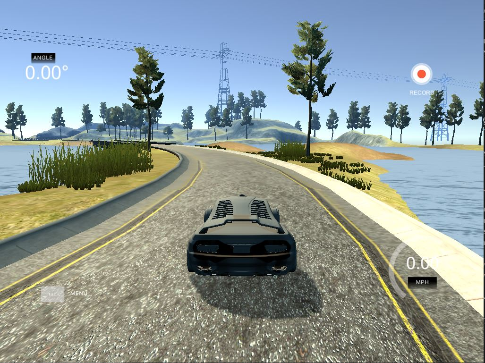

**Figure 5: Right Side of Road Recovery Part 3**

When I was testing the model and watched it drive the car in the simulator, one area I noticed on the track that needed more driving recovery data were these curves that have water in the car's field of view. The model usually drove off the road until the adequate recovery data was used to train the model.

Here is another area on the track that the model would drive off the track, so I also collected driving recovery data:

**Driving recovery for left side of the road back to center:**

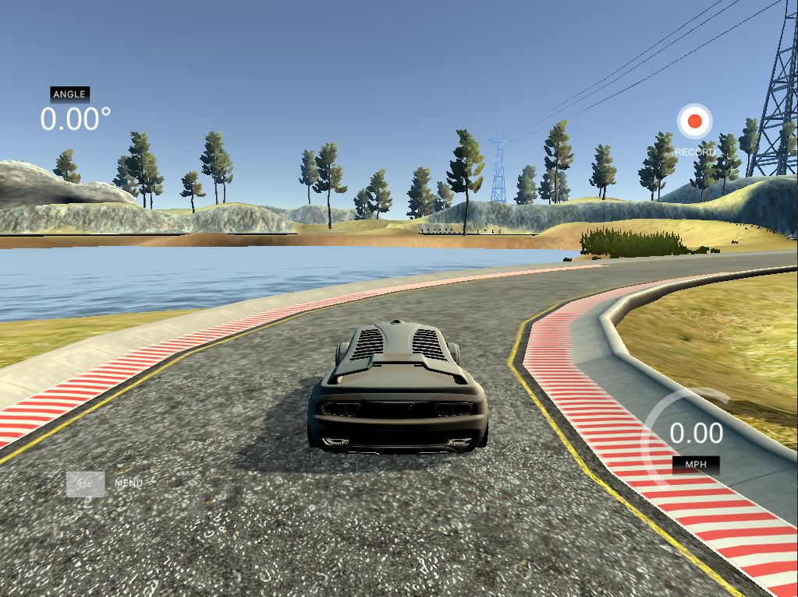

**Figure 6: Left Side of Road Recovery Part 1**

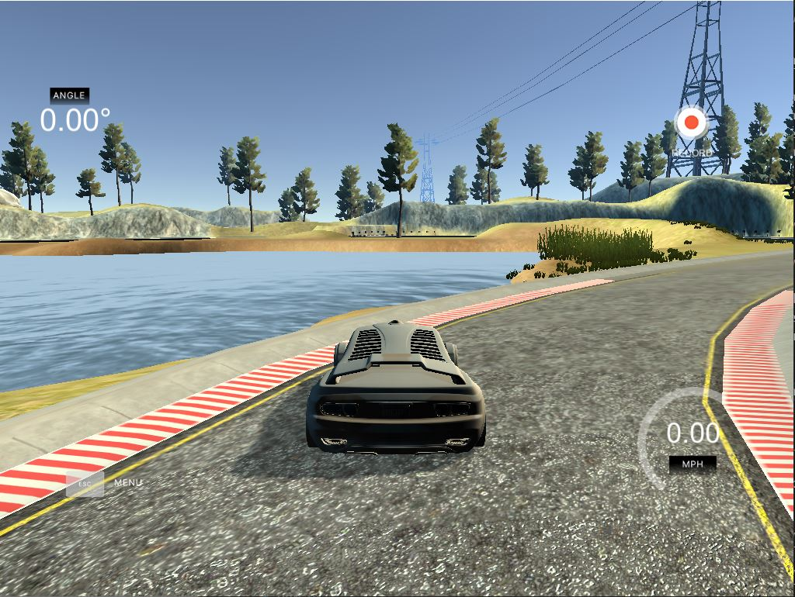

**Figure 7: Left Side of Road Recovery Part 2**

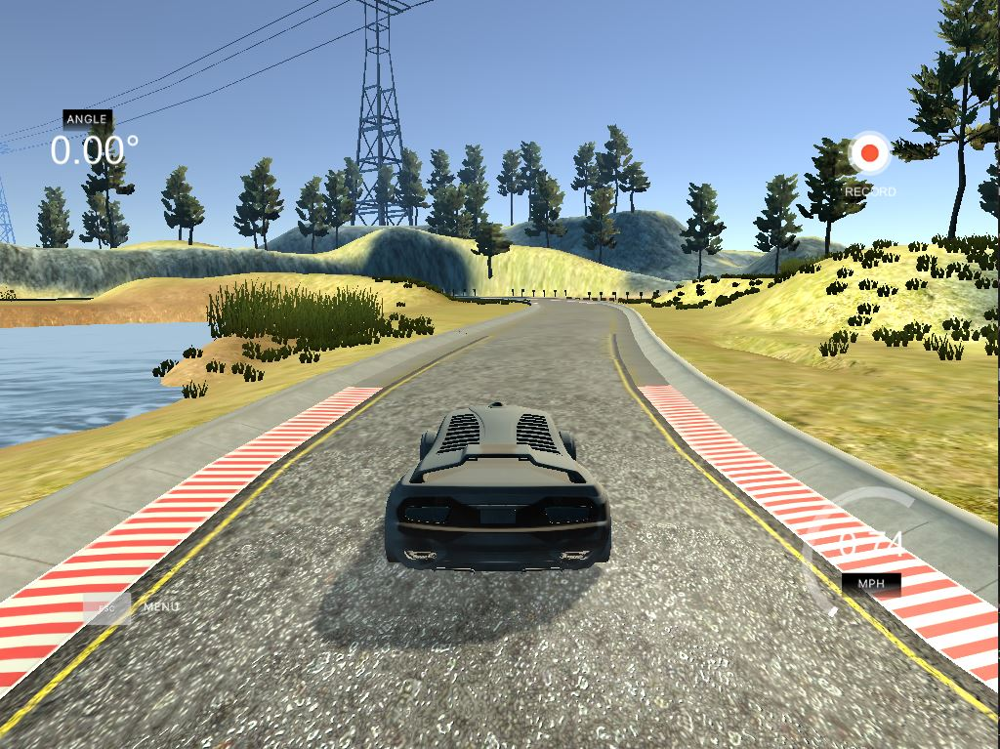

**Figure 8: Left Side of Road Recovery Part 3**

The next area on the track I noticed the model struggled was at the bridge. Sometimes the model crashed into the right or left wall. So I collected recovery data for the bridge:

**Driving recovery for right side of the bridge back to center:**

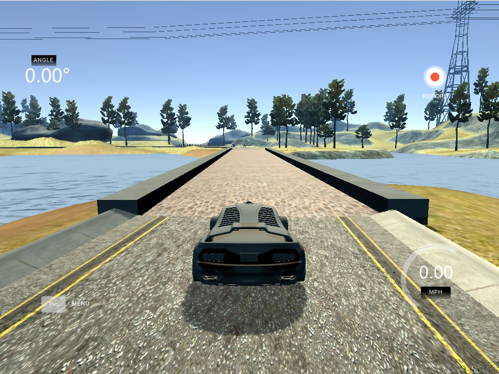

**Figure 9: Right Side of Bridge Recovery Part 1**

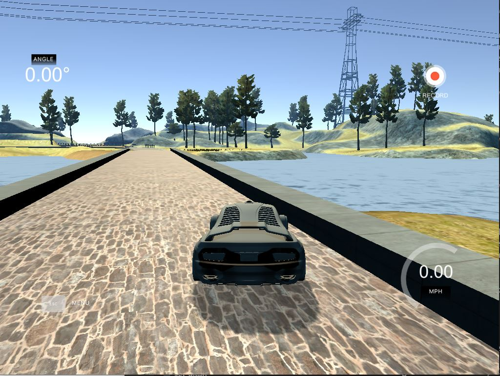

**Figure 10: Right Side of Bridge Recovery Part 2**

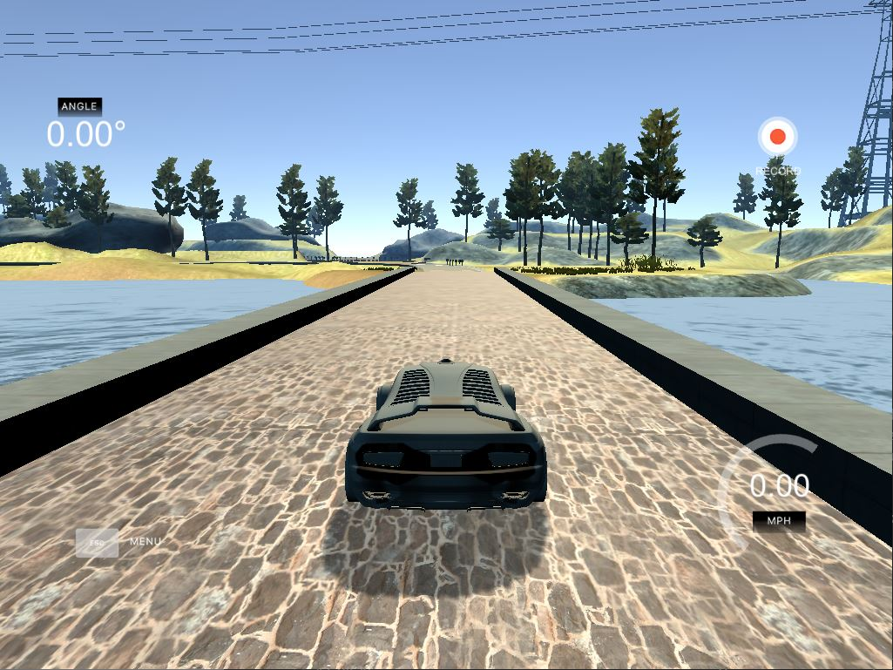

**Figure 11: Right Side of Bridge Recovery Part 3**

After the collection process, I had 26,443 images. I then preprocessed this data by adding a steering angle label for the left and right camera images using a correction factor of plus or minus 0.2, performing data augmentation technique image flipping and steering angle inversion, applying image normalization to change the range of pixel intensity making all images have a consistent range for pixel values and cropping the images to remove the noise from trees and car's front hood.

I finally randomly shuffled the data set and put 20% of the data into a validation set. 

I used this training data for training the model. The validation set helped determine if the model was over or under fitting. The ideal number of epochs was 4 as evidenced by the following image showing a validation loss after training the Keras model. I used an adam optimizer so that manually training the learning rate wasn't necessary.

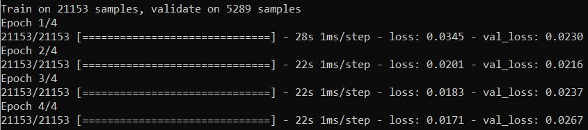

**Figure 12: Trained Keras CNN Model Training & Validation Loss**

Now that we have a trained model, here is the video of the model driving the car safely around the track for 1 lap.

Keras Behavioral Cloning Demo Video: [run5.mp4](run5.mp4)

run5.mp4 uploaded to YouTube: [Keras Behavioral Cloning Demo](https://youtu.be/HwXI2E19SjY)

## Udacity Self-Driving Car Engineer ND References

- Udacity SDCE ND, Lesson 17 - Keras
- Udacity SDCE ND, Lesson 18 - Transfer Learning
- Udacity SDCE ND, Project: Behavioral Cloning 